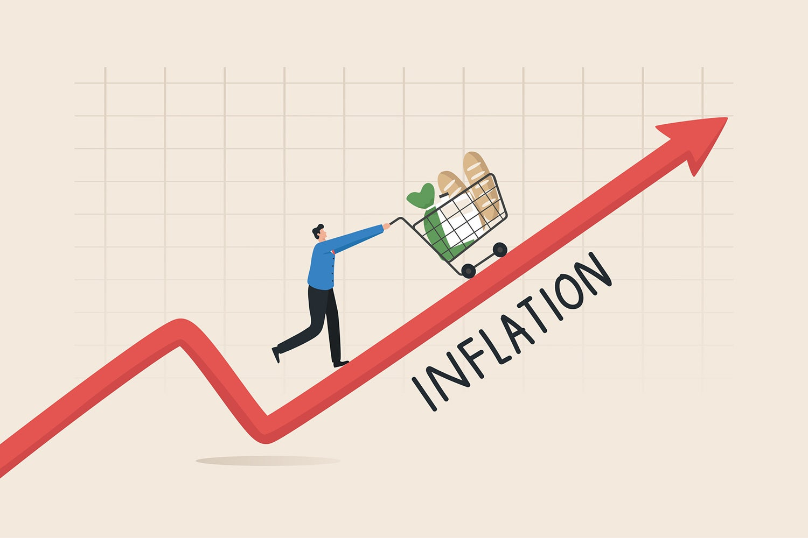

# Analiza medijske pokrivenosti inflacije u Hrvatskoj
## Pregled

Ovaj repozitorij sadrži kod, podatke i analize za praćenje medijske pokrivenosti inflacije u Hrvatskoj kroz GIMES (Government-Industry-Media Economic Sentiment) indeks. Projekt analizira članke hrvatskih online medija od 2021. do 2024. godine kako bi konstruirao kompozitni indeks medijske pozornosti na inflaciju.

## Status projekta

**Trenutna verzija**: 1.0  
**Zadnje ažurirano**: Prosinac 2024  
**Razdoblje pokrivenosti**: Siječanj 2021 Studeni 2024  
**Jezik**: Hrvatski s dvojezičnom dokumentacijom

## Ključne značajke

- Sustavna identifikacija članaka o inflaciji korištenjem višestupanjskog filtriranja
- Konstrukcija GIMES indeksa medijske inflacije (skala 0-100)
- Text mining i obrada prirodnog jezika za hrvatski jezik
- Validacija u odnosu na službene Eurostat HICP podatke
- Lead/lag analiza i okvir za prediktivno modeliranje
- Sveobuhvatna vizualizacija i izvještavanje


## Podaci

### Struktura ulaznih podataka

Glavni dataset treba sadržavati sljedeća polja:

| Polje | Tip | Opis |
|-------|------|-------------|
| DATE | Date | Datum objave |
| TITLE | Text | Naslov članka |
| FULL_TEXT | Text | Kompletan tekst članka |
| FROM | Text | Ime izvora/portala |
| SOURCE_TYPE | Text | Tip izvora (web/print/tv) |
| AUTO_SENTIMENT | Numeric | Rezultat sentimenta (-1, 0, 1) |
| REACH | Numeric | Doseg članka/pregledi |
| INTERACTIONS | Numeric | Korisničke interakcije |

Vidjeti `docs/data_dictionary.md` za kompletne definicije varijabli.

### Eurostat podaci

Službeni hrvatski HICP podaci preuzeti iz Eurostat dataseta `prc_hicp_manr`:
- Headline HICP (CP00)
- Core HICP (CP00XEF isključena energija i hrana)
- Mjesečna frekvencija, YoY postotna promjena

## GIMES Indeks

GIMES (Government-Industry-Media Economic Sentiment) indeks je kompozitna mjera (0-100) koja kombinira:

- **Volumen (40%)**: Broj članaka
- **Intenzitet (20%)**: Prosječna duljina članaka
- **Sentiment (20%)**: Prosječni sentiment (invertiran)
- **Doseg (20%)**: Prosječni doseg/angažman

**Formula**:
```
GIMES = 0.4 × Volumen_norm + 0.2 × Intenzitet_norm + 0.2 × (100 - Sentiment_norm) + 0.2 × Doseg_norm
```

Više vrijednosti označavaju veću medijsku pozornost i zabrinutost oko inflacije.

## Ključni nalazi

- **Jaka korelacija** (r ≈ 0.85) između GIMES indeksa i službene HICP inflacije
- Medijsko izvještavanje je **reaktivno** prije nego prediktivno (nema značajnog predvođenja)
- Vrhunac medijske pozornosti: **Q4 2022** podudarajući se sa vrhuncem inflacije
- **Cijene energije** dominirale pokrivenošću 2022., **cijene hrane** prominentnije 2023.
- Približno **75% negativan sentiment** u člancima o inflaciji

## Metodološki highlights

### Filtriranje članaka (6 faza)

1. **Tip izvora**: Samo web izvori
2. **Odabir portala**: 80+ verificiranih hrvatskih news portala
3. **Duljina teksta**: Minimum 500 znakova
4. **Relevantnost naslova**: Mora sadržavati pojmove vezane uz inflaciju
5. **Core pojmovi**: Tekst mora sadržavati sadržajan vokabular o inflaciji
6. **Hrvatski kontekst**: Mora referirati hrvatsku ekonomiju/institucije

### Text Mining

- Prilagođena hrvatska lista stop riječi
- Ekstrakcija bigrama i trigrama
- Vremenska analiza frekvencije pojmova
- Spominjanje cijena po kategorijama (energija, hrana, stanovanje, transport)

### Validacija

- Analiza unakrsne korelacije sa službenom inflacijom
- Okvir za Granger causality testiranje
- Izračuni korelacija sa više pomaka

## Doprinosi

Doprinosi su dobrodošli! Molimo:

1. Forkajte repozitorij
2. Kreirajte feature branch (`git checkout -b feature/izvrsna-funkcionalnost`)
3. Commitajte promjene (`git commit -m 'Dodaj izvrsnu funkcionalnost'`)
4. Pushajte na branch (`git push origin feature/izvrsna-funkcionalnost`)
5. Otvorite Pull Request


## Licenca

Ovaj projekt licenciran je pod MIT licencom pogledajte `LICENSE` datoteku za detalje.

Izvori podataka:
- Medijski članci: Vlasnički (nisu redistribuirani)
- Eurostat podaci: CC-BY-4.0 (https://ec.europa.eu/eurostat)

## Kontakt

**Autor**: [Luka Sikic]  
**Institucija**: [UNICATH.hr]  
**Stranica projekta**: https://github.com/lusiki/GIMES_HR-inflacija


## Povijest promjena

### Verzija 1.0 (Prosinac 2024)
- Inicijalno izdanje
- Kompletna pipeline za filtriranje
- Konstrukcija GIMES indeksa
- Sveobuhvatni Quarto izvještaj sa text miningom
- Validacija u odnosu na Eurostat podatke

## Roadmap

**Planirane značajke**:
- [ ] Real-time dashboard s mjesečnim ažuriranjima
- [ ] API za pristup GIMES indeksu
- [ ] Machine learning modeli za predikciju
- [ ] Regionalna analiza (Zagreb vs. ostale regije)
- [ ] Komparativna analiza s drugim EU zemljama
- [ ] Interaktivna Shiny aplikacija
- [ ] Topic modeling (LDA/NMF)
- [ ] Named entity recognition za hrvatski
- [ ] Integracija s HNB survey podacima o inflacijskim očekivanjima


---

**Zadnje ažurirano**: Prosinac 2024  
**Održavatelj**: lux